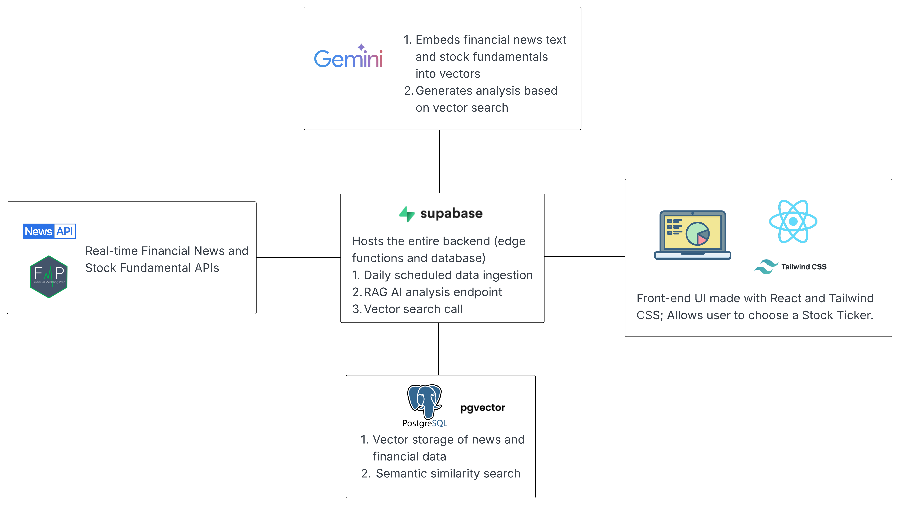

# Stock Analyzer - AI-Powered Financial Analysis

An AI-generated stock analysis platform that uses real-time news and financial data through Retrieval-Augmented Generation (RAG).

## Features

- Real-time news analysis (NewsAPI)
- Financial fundamentals (P/E, ROE, market cap)
- AI insights via Google Gemini
- Semantic search with vector embeddings

## Tech Stack

- **Frontend:** React, Tailwind CSS
- **Backend:** Supabase, Deno, PostgreSQL + pgvector
- **AI:** Google Gemini (embeddings + generation)
- **Data Sources:** NewsAPI, Financial Modeling Prep

## Supported Stocks

GOOG, AAPL, AMZN, MSFT, TSLA, NVDA, META, BRK-B, SPY, VOO, QQQ, VTI, IVV

## How It Works

1. **Ingest:** Collect news and financials → generate embeddings → store in vector database  
2. **Query:** User selects a ticker → perform similarity search → generate AI analysis  
3. **Output:** Comprehensive analysis with citations  

## Key Components

- `/ingest` - Data collection & embedding generation  
- `/rag-analysis` - Main analysis endpoint  
- `/vector-search` - Semantic search  
- **React UI** - Stock selector & results display

